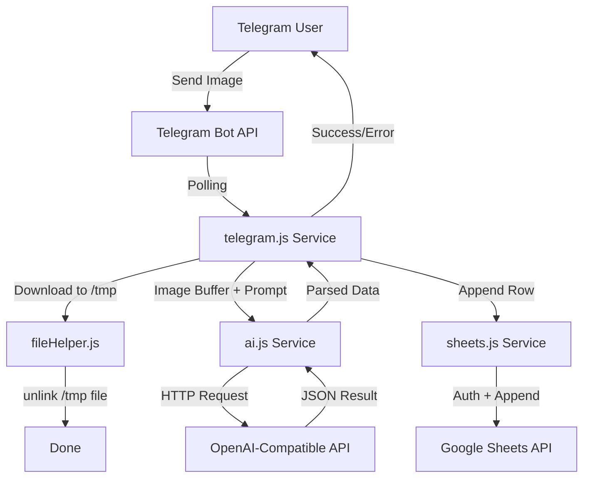

# Project Overview

Backend Node.js application that receives images from Telegram, extracts structured data using an OpenAI-compatible AI model, and appends results to Google Sheets. Designed for low-memory environments (STB-class hardware — target idle RAM < 50MB) with PM2 process management and winston-based tiered logging.

---

## Repository Structure

```text
telegram-extractor/
├── .env                     # Environment variables (API keys, secrets) — gitignored
├── .gitignore               # Ignores node_modules, .env, logs/
├── package.json             # Project metadata and npm dependencies
├── package-lock.json        # Locked dependency versions
├── ecosystem.config.js      # PM2 cluster configuration (2 instances, env profiles)
├── logs/                    # Runtime error logs (gitignored, production only)
├── node_modules/            # Installed dependencies (gitignored)
├── .Agents/                 # Agent skills and documentation
│   ├── AGENTS.md            # This file
│   ├── PRD.md               # Product Requirements Document
│   ├── brainstorming/       # Skill: creative feature exploration
│   ├── codebase-design/     # Skill: scalable architecture planning
│   ├── systematic-debugging/# Skill: structured debugging methodology
│   ├── test-driven-development/ # Skill: TDD workflows
│   └── implement/           # Skill: structured feature implementation
└── src/
    ├── index.js             # Entry point — initializes services and listeners
    ├── config/
    │   └── config.js        # Centralised .env validation and export
    ├── services/
    │   ├── telegram.js      # Telegram bot logic (receive, download, reply)
    │   ├── ai.js            # OpenAI client instantiation + image-to-text
    │   └── sheets.js        # Google Sheets auth and appendRow
    └── utils/
        ├── logger.js        # Winston logger (debug/info to console, error to file)
        └── fileHelper.js    # Helper functions (e.g. temp file cleanup)
```

---

## Build & Development Commands

| Command | Description |
|---|---|
| `npm install` | Install all dependencies from package.json |
| `npm run start` | Run in production mode (`node src/index.js`) |
| `npm run dev` | Run in development mode (`NODE_ENV=development`) |
| `pm2 start ecosystem.config.js` | Start via PM2 (cluster mode, 2 instances) |
| `pm2 logs telegram-extractor` | Tail live logs |
| `pm2 stop telegram-extractor` | Stop the application |
| `pm2 restart telegram-extractor` | Restart all instances |
| `pm2 save && pm2 startup` | Enable autostart on system boot |

> TODO: Add `npm test` and `npm run lint` scripts once test framework and linter are configured.

---

## Code Style & Conventions

### Formatting & Naming

- **Language:** JavaScript (Node.js, ES6+ with CommonJS `require`/`module.exports`).
- **Case:**
  - `camelCase` — variables, functions, method names.
  - `PascalCase` — classes, constructor functions.
  - `UPPER_SNAKE_CASE` — environment variable keys (e.g. `TELEGRAM_BOT_TOKEN`).
- **Files:** Lowercase with hyphens (`kebab-case.js`), placed in the folder matching their role (`services/`, `utils/`, `config/`).
- **Indentation:** 2 spaces (consistent with existing files).

### Service Pattern

- Each external integration gets its own file under `src/services/`:
  - `telegram.js` — only Telegram API concerns.
  - `ai.js` — only AI provider concerns.
  - `sheets.js` — only Google Sheets concerns.
- Services receive dependencies via `require()`; no global state.
- `config.js` is the single source of truth for all environment variables.

### Logging

- Use `logger.info()`, `logger.warn()`, `logger.error()` from `src/utils/logger.js`.
- In development: all levels print to console.
- In production: `info`+ goes to console (captured by PM2), `error`+ persists to `logs/error.log`.
- Avoid `console.log` in production code — use the logger instead.

### Commit Messages

- Imperative mood, subject ≤ 50 characters.
- Capitalised, no trailing punctuation.
- Body (optional) wraps at 72 characters.
- Do not repeat subject information in the body.

---

## Architecture Notes

### Component Diagram



### Data Flow

1. **Telegram Polling** — `node-telegram-bot-api` polls for incoming messages.
2. **Chat ID Validation** — message `chat_id` is checked against `ALLOWED_CHAT_ID`. Non-matching IDs are silently dropped.
3. **File Download** — valid messages with images are downloaded to `/tmp/<uuid>.jpg`.
4. **AI Extraction** — image file is sent to the configured AI endpoint (`AI_BASE_URL` + `AI_MODEL`) along with a system prompt. Returns JSON.
5. **File Cleanup** — the temp file is immediately unlinked regardless of AI success/failure.
6. **Sheets Append** — parsed JSON data is appended as a new row to the Google Sheet.
7. **Telegram Reply** — bot sends a success confirmation or error message back to the user.

### Key Design Decisions

- **Long Polling** over Webhooks — simpler for STB deployment (no public IP / TLS needed).
- **PM2 Cluster Mode** — `instances: "max"` leverages available CPU cores while keeping memory predictable.
- **Error-Only File Logging** — minimises write cycles on eMMC/flash storage.

> TODO: Flowchart needs to be finalised once AI response schema is defined.

---

## Testing Strategy

- **Test Framework:** > TODO: Select and install (recommended: `jest` or `mocha` + `chai`).
- **Location:** Tests should live in `src/__tests__/` mirroring the source structure.
- **Unit Tests:** Each service (`telegram.js`, `ai.js`, `sheets.js`) should have isolated unit tests with mocked HTTP/file I/O.
- **Integration Tests:** > TODO: Define end-to-end flow with a test Telegram bot + test Google Sheet + mock AI provider.
- **CI:** > TODO: Configure GitHub Actions or equivalent (run `npm test` on push/PR).

```bash
# Expected (once configured):
npm test          # Run all tests
npm run test:watch  # Watch mode
npm run coverage    # Coverage report
```

---

## Security & Compliance

### Secrets Management

- **All secrets** live in `.env` — this file is in `.gitignore` and must never be committed.
- `.env` template is documented in `PRD.md` Section 6.
- Required variables:
  - `TELEGRAM_BOT_TOKEN`
  - `ALLOWED_CHAT_ID`
  - `AI_API_KEY`
  - `GOOGLE_SERVICE_ACCOUNT_EMAIL`
  - `GOOGLE_PRIVATE_KEY`
  - `GOOGLE_SHEET_ID`
- `config.js` warns on startup if any variable is `undefined`.

### Chat ID Whitelist

- Only the Telegram user ID in `ALLOWED_CHAT_ID` can interact with the bot.
- Unknown chat IDs are silently dropped with no log output (prevents information leakage).

### Dependency Scanning

- Run `npm audit` periodically to check for known vulnerabilities.
- > TODO: Integrate `snyk` or `socket.dev` for automated scanning in CI.

### Log Safety

- Error logs are written to `logs/error.log` — only in production.
- Log files must never contain raw secrets or full image payloads.

---

## Agent Guardrails

The following files and directories **must not** be modified by automated agents without explicit user confirmation:

| Path | Reason |
|---|---|
| `.env` | Contains live secrets; manual setup only |
| `package.json` / `package-lock.json` | Dependency changes need human review |
| `ecosystem.config.js` | PM2 tuning is environment-specific |
| `logs/` | Runtime artefacts, not source code |
| `node_modules/` | Managed by npm; never commit or edit |
| `.Agents/PRD.md` | Product requirements document — read-only reference |
| `.Agents/AGENTS.md` | This file — agent instructions, do not edit |

Services in `src/services/` and utilities in `src/utils/` **may** be edited freely according to the PRD and this document.

---

## Extensibility Hooks

### Environment Variables (`.env`)

| Variable | Purpose | Default |
|---|---|---|
| `NODE_ENV` | Toggles development vs production logging | `production` |
| `AI_BASE_URL` | API base URL (swap for Groq, Ollama, local LLM, etc.) | `https://api.openai.com/v1` |
| `AI_MODEL` | Model identifier (e.g. `gpt-4o-mini`, `llama-3.1-8b`) | `gpt-4o-mini` |
| `ALLOWED_CHAT_ID` | Single Telegram user ID allowed to send images | _required_ |

Adding a new AI provider requires only changing `AI_BASE_URL` and `AI_MODEL` — no code changes.

### Service Pattern

Each service is an independent module. To add a new integration:

1. Create `src/services/<name>.js` with the business logic.
2. Export a single function or class.
3. Wire it into `src/index.js`.
4. Add any new env vars to `src/config/config.js`.

### Available Agent Skills (in `.Agents/`)

| Skill | Purpose |
|---|---|
| `brainstorming/` | Feature ideation while preserving modularity |
| `codebase-design/` | Architecture validation and refactoring guidance |
| `systematic-debugging/` | Structured problem isolation |
| `test-driven-development/` | Test-first implementation workflows |
| `implement/` | Consistent feature implementation patterns |

### Feature Flags / Future Hooks

- > TODO: Add `ENABLE_WEBHOOK` flag if webhook-based delivery is needed (requires public URL + SSL).
- > TODO: Add `RATE_LIMIT` / `MAX_FILE_SIZE_MB` to `.env` for production hardening.
- > TODO: Add `LOG_LEVEL` to `.env` for finer-grained control over winston verbosity.